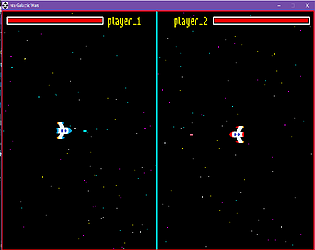

# War Ship Space - Jeu Vidéo avec Pygame

## Description du Projet

Bienvenue dans le projet "War Ship Space" ! Ce jeu vidéo captivant est développé en utilisant Pygame, une bibliothèque Python dédiée au développement de jeux 2D. L'objectif principal de ce projet est de créer une expérience immersive de bataille spatiale, où les joueurs peuvent piloter un vaisseau de guerre spatial et affronter des ennemis dans l'immensité de l'espace.

## Technologies Utilisées

- Pygame : Une bibliothèque Python pour le développement de jeux 2D, offrant des fonctionnalités pour la gestion des événements, l'affichage graphique, et bien plus encore.

## Fonctionnalités

1. **Vaisseau Spatial Personnalisable :** Les joueurs peuvent choisir et personnaliser leur vaisseau spatial parmi une gamme de modèles disponibles.

2. **Batailles Spatiales Épiques :** Affrontez des vagues d'ennemis spatiaux dans des batailles intenses et dynamiques.

3. **Améliorations et Power-ups :** Gagnez des points et des améliorations pour renforcer les capacités de votre vaisseau spatial.

4. **Environnements Spatiaux Uniques :** Explorez différents environnements spatiaux avec des graphismes captivants.

5. **Système de Scores :** Un système de scores pour suivre et comparer les performances des joueurs.

## Comment Jouer

1. **Installation de Pygame :** Assurez-vous d'installer Pygame sur votre système. Vous pouvez le faire en utilisant la commande suivante :
   ```bash
   pip install pygame
2. **Execution du jeu :** Utiliser la commande suivante : 
   ```bash
   python main.py

## Vue génerale 



